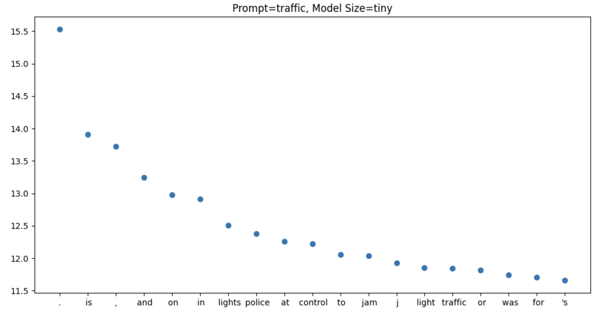

# Macroscopic Properties of the Decoder

## The decoder is a weak LM
Whisper is trained exclusively on supervised speech-to-text data; the decoder is **not** pre-trained on text. In spite of this, the model still acquires rudimentary language modeling capabilities. While this outcome isn't unexpected, the subsequent experiments that validate this phenomenon are quite interesting in themselves.

*For context: Whisper is an encoder-decoder transformer model. The input to the encoder is a 30s chunk of audio (shorter chunks can be padded) and the ouput from the decoder is a transcript, predicted autoregressively.*

## Bigrams
If we use just padding frames as the input of the encoder and 'prompt' the decoder we can recover bigram statistics. For example,

The start of the transcription is normally indicated by:\
`<|startoftranscript|><|en|><|transcribe|>`

Instead we set it to be:\
`<|startoftranscript|><|en|><|transcribe|> <prompt>`

Below we plot the top 20 most likely next tokens and their corresponding logit for a variety of prompts. We can see that when the model has no acoustic information it relys on learnt bigrams.

## Embedding space

Bigram statistics are often learnt by the token embedding layer in transformer language models. Additionally, we observe semantically similar words clustered in embedding space. This phenomenon holds for Whisper model, but additionally we discover that words with **similar sounds** also exhibit proximity in the embedding space. To illustrate this, we choose specific words and then create a plot of the 20 nearest tokens based on their cosine similarity.\
\
'rug' is close in embedding space to lug, mug and tug. This is not very surprising of a speech-to-text model; if you *think* you hear the word 'rug', it is quite likely that the word was in fact lug or mug.

Often tokens that are close in embedding space are a combination of rhyming words **and** semantically similar words:

# Acoustic Features
We found max activating dataset examples for all of the neurons in the mlp layers of the encoder. We also trained sparse autoencoders on the residual stream activations and found max activating dataset examples for these learnt features. By amplifying the sound around the point where the neuron/feature is maximally active, we found them to be highly interpretable. Below are examples of some of the features we found.

## encoder.blocks.3.mlp.1 - Neuron Basis

Neuron 4 ('said')

<audio controls>
   <source src="audio/b3_mlp1_nb_4pkl_sample0.wav" type="audio/wav">
   Your browser does not support the audio element.
</audio>
<audio controls>
   <source src="audio/b3_mlp1_nb_4pkl_sample3.wav" type="audio/wav">
   Your browser does not support the audio element.
</audio>
<audio controls>
   <source src="audio/b3_mlp1_nb_4pkl_sample4.wav" type="audio/wav">
   Your browser does not support the audio element.
</audio>
<audio controls>
   <source src="audio/b3_mlp1_nb_4pkl_sample8.wav" type="audio/wav">
   Your browser does not support the audio element.
</audio>

Neuron 9 ('way/wait')

<audio controls>
   <source src="audio/b3_mlp1_nb_9pkl_sample5.wav" type="audio/wav">
   Your browser does not support the audio element.
</audio>
<audio controls>
   <source src="audio/b3_mlp1_nb_9pkl_sample8.wav" type="audio/wav">
   Your browser does not support the audio element.
</audio>
<audio controls>
   <source src="audio/b3_mlp1_nb_9pkl_sample9.wav" type="audio/wav">
   Your browser does not support the audio element.
</audio>

Neuron 20 ('f')

<audio controls>
   <source src="audio/b3_mlp1_nb_20pkl_sample0.wav" type="audio/wav">
   Your browser does not support the audio element.
</audio>
<audio controls>
   <source src="audio/b3_mlp1_nb_20pkl_sample6.wav" type="audio/wav">
   Your browser does not support the audio element.
</audio>
<audio controls>
   <source src="audio/b3_mlp1_nb_20pkl_sample8.wav" type="audio/wav">
   Your browser does not support the audio element.
</audio>
<audio controls>
   <source src="audio/b3_mlp1_nb_20pkl_sample9.wav" type="audio/wav">
   Your browser does not support the audio element.
</audio>

## encoder.blocks.2.mlp.1 - Neuron Basis

Neuron 0 ('m')

<audio controls>
   <source src="audio/b2_mlp1_nb_0pkl_sample3.wav" type="audio/wav">
   Your browser does not support the audio element.
</audio>
<audio controls>
   <source src="audio/b2_mlp1_nb_0pkl_sample6.wav" type="audio/wav">
   Your browser does not support the audio element.
</audio>
<audio controls>
   <source src="audio/b2_mlp1_nb_0pkl_sample7.wav" type="audio/wav">
   Your browser does not support the audio element.
</audio>
<audio controls>
   <source src="audio/b2_mlp1_nb_0pkl_sample8.wav" type="audio/wav">
   Your browser does not support the audio element.
</audio>

Neuron 1 ('sh/ch'))

<audio controls>
   <source src="audio/b2_mlp1_nb_1pkl_sample1.wav" type="audio/wav">
   Your browser does not support the audio element.
</audio>
<audio controls>
   <source src="audio/b2_mlp1_nb_1pkl_sample2.wav" type="audio/wav">
   Your browser does not support the audio element.
</audio>
<audio controls>
   <source src="audio/b2_mlp1_nb_1pkl_sample8.wav" type="audio/wav">
   Your browser does not support the audio element.
</audio>
<audio controls>
   <source src="audio/b2_mlp1_nb_1pkl_sample9.wav" type="audio/wav">
   Your browser does not support the audio element.
</audio>

Neuron 3 ('c')

<audio controls>
   <source src="audio/b2_mlp1_nb_3pkl_sample4.wav" type="audio/wav">
   Your browser does not support the audio element.
</audio>
<audio controls>
   <source src="audio/b2_mlp1_nb_3pkl_sample5.wav" type="audio/wav">
   Your browser does not support the audio element.
</audio>
<audio controls>
   <source src="audio/b2_mlp1_nb_3pkl_sample6.wav" type="audio/wav">
   Your browser does not support the audio element.
</audio>
<audio controls>
   <source src="audio/b2_mlp1_nb_3pkl_sample8.wav" type="audio/wav">
   Your browser does not support the audio element.
</audio>

## encoder.blocks.3 - Learnt using sparse autoencoder

Dictionary idx=131 ("r")

<audio controls>
   <source src="audio/b3_res_131pkl_sample2.wav" type="audio/wav">
   Your browser does not support the audio element.
</audio>
<audio controls>
   <source src="audio/b3_res_131pkl_sample7.wav" type="audio/wav">
   Your browser does not support the audio element.
</audio>
<audio controls>
   <source src="audio/b3_res_131pkl_sample9.wav" type="audio/wav">
   Your browser does not support the audio element.
</audio>
<audio controls>
   <source src="audio/b3_res_131pkl_sample8.wav" type="audio/wav">
   Your browser does not support the audio element.
</audio>

Dictionary idx=1 ("n")

<audio controls>
   <source src="audio/b3_res_1pkl_sample0.wav" type="audio/wav">
   Your browser does not support the audio element.
</audio>
<audio controls>
   <source src="audio/b3_res_1pkl_sample1.wav" type="audio/wav">
   Your browser does not support the audio element.
</audio>
<audio controls>
   <source src="audio/b3_res_1pkl_sample3.wav" type="audio/wav">
   Your browser does not support the audio element.
</audio>
<audio controls>
   <source src="audio/b3_res_1pkl_sample8.wav" type="audio/wav">
   Your browser does not support the audio element.
</audio>

Dictionary idx=2 ("p")

<audio controls>
   <source src="audio/b3_res_2pkl_sample0.wav" type="audio/wav">
   Your browser does not support the audio element.
</audio>
<audio controls>
   <source src="audio/b3_res_2pkl_sample2.wav" type="audio/wav">
   Your browser does not support the audio element.
</audio>
<audio controls>
   <source src="audio/b3_res_2pkl_sample3.wav" type="audio/wav">
   Your browser does not support the audio element.
</audio>
<audio controls>
   <source src="audio/b3_res_2pkl_sample9.wav" type="audio/wav">
   Your browser does not support the audio element.
</audio>

## encoder.blocks.2 - Learnt using sparse autoencoder

Dictionary idx=3 ("an/in/on")

<audio controls>
   <source src="audio/b2_res_3pkl_sample1.wav" type="audio/wav">
   Your browser does not support the audio element.
</audio>
<audio controls>
   <source src="audio/b2_res_3pkl_sample6.wav" type="audio/wav">
   Your browser does not support the audio element.
</audio>
<audio controls>
   <source src="audio/b2_res_3pkl_sample9.wav" type="audio/wav">
   Your browser does not support the audio element.
</audio>
<audio controls>
   <source src="audio/b2_res_3pkl_sample8.wav" type="audio/wav">
   Your browser does not support the audio element.
</audio>

Dictionary idx=4 ("I (eg time/try/I))

<audio controls>
   <source src="audio/b2_res_4pkl_sample3.wav" type="audio/wav">
   Your browser does not support the audio element.
</audio>
<audio controls>
   <source src="audio/b2_res_4pkl_sample6.wav" type="audio/wav">
   Your browser does not support the audio element.
</audio>
<audio controls>
   <source src="audio/b2_res_4pkl_sample9.wav" type="audio/wav">
   Your browser does not support the audio element.
</audio>
<audio controls>
   <source src="audio/b2_res_4pkl_sample7.wav" type="audio/wav">
   Your browser does not support the audio element.
</audio>

Dictionary idx=6 ("l" (eg lost))

<audio controls>
   <source src="audio/b2_res_6pkl_sample0.wav" type="audio/wav">
   Your browser does not support the audio element.
</audio>
<audio controls>
   <source src="audio/b2_res_6pkl_sample2.wav" type="audio/wav">
   Your browser does not support the audio element.
</audio>
<audio controls>
   <source src="audio/b2_res_6pkl_sample9.wav" type="audio/wav">
   Your browser does not support the audio element.
</audio>
<audio controls>
   <source src="audio/b2_res_6pkl_sample3.wav" type="audio/wav">
   Your browser does not support the audio element.
</audio>

# Polysemantic acoustic neurons
It is commonly understood that both language and image models contain polysemantic neurons. The following plots confirm the existence of polysemic acoustic neurons activating for distinct sounds across various levels of activation.

    <figure style="margin-bottom: 20px;">
        
    </figure>
    <figure style="margin-bottom: 20px;">
        
    </figure>
    <figcaption>Plots showing the number of activations matching a sound for different activation ranges</figcaption>

## Audio samples for polysemantic neurons

Neuron 3 ('c/g')

<audio controls>
   <source src="audio/b2_mlp_1_1pkl_poly_c.wav" type="audio/wav">
   Your browser does not support the audio element.
</audio>
<audio controls>
   <source src="audio/b2_mlp_1_1pkl_poly_g.wav" type="audio/wav">
   Your browser does not support the audio element.
</audio>

Neuron 1 ('sh/ch/j')

<audio controls>
   <source src="audio/b2_mlp_1_1pkl_poly_sh.wav" type="audio/wav">
   Your browser does not support the audio element.
</audio>
<audio controls>
   <source src="audio/b2_mlp_1_1pkl_poly_ch.wav" type="audio/wav">
   Your browser does not support the audio element.
</audio>
<audio controls>
   <source src="audio/b2_mlp_1_1pkl_poly_j.wav" type="audio/wav">
   Your browser does not support the audio element.
</audio>

# Macroscopic Properties of the Encoder

## Attention patterns are very localized
We propagate the attention scores $R_{t}$ down the layers of the encoder as in [Generic Attention-model Explainability for Interpreting Bi-Modal and Encoder-Decoder Transformers](https://arxiv.org/pdf/2103.15679.pdf). This roughly equates to,  
$$R_{t+1} = R_{t} + \bar A_{t+1} R_{t},$$
where  
$$\bar A_t = \mathbb{E}[\nabla A_t \circ A_t],$$
$A_{t}$ is the attention pattern in layer $t$ and $\bar A_{t}$ is the attention pattern weighted by gradient contribution. 
This produces the striking pattern below; up to the point where the audio ends, the attention pattern is very localized. When the speech ends (at frame ~500 in the following plot), all future positions attend back to the end of the speech.

    

## Constraining the attention window
Given how localized the attention pattern appears to be, we investigate what happens if we constrain it so that every audio embedding can only attend to the k nearest tokens on either side. Eg if k=2 we would we apply the following mask to the attention scores before the softmax:

    

Here are the transcripts that emerge as we limit the attention window for various k values. We observe that even when k is reduced to 75, the model continues to generate reasonably precise transcripts, indicating that information is being encoded in a localized manner.

##### Original transcript (seq_len=1500):  
'hot ones. The show where celebrities answer hot questions while feeding even hotter wings.' 

##### k=100:  
"Hot ones. The show where celebrities answer hot questions, what feeding, eating hot wings. I am Shana Evans. I'm Join Today." 

##### k=75:  
"The show with celebrities and their hot questions, what feeding, eating hot wings. Hi, I'm Shannon, and I'm joined today." 

##### k=50:  
'The show where celebrities enter hot questions, what leading, what leading, what are we.' 

##### k=20:  
"I'm joined today."

##### k=10:  
""

## Removing words in embedding space
Recall that Whisper is an encoder-decoder transformer; the decoder cross-attends to the output of the final layer of the encoder. Given the apparent localization of the embeddings in this final layer, we postulate that we could remove words from the transcript by 'chopping' them out in embedding space. Concretely we let,

`final_layer_output[start_index:stop_index] = final_layer_output_for_padded_input[start_index:stop_index]`,

 where `final_layer_output_for_padded_input` is the output of the encoder when we just use padding frames as the input.

Consider the following example in which we substitute the initial 50 audio embeddings with padded equivalents (e.g., start_index=0, stop_index=50). These 50 embeddings represent $(50/1500)*30s=1s$ of audio. Our observation reveals that the transcript resulting from this replacement omits the initial two words.

Audio Sample

<audio controls>
   <source src="encoder/Hot_ones.wav" type="audio/wav">
   Your browser does not support the audio element.
</audio>

##### Original Transcript:
`hot ones. The show where celebrities answer hot questions while feeding even hotter wings.`  
##### Substitute embedding between (start_index=0, stop_index=50):     
`The show where celebrities answer hot questions while feeding even hotter wings.`   

We can also do this in the middle of the sequence. Here we let (start_index=150, stop_index=175) which corresponds to 3-3.5s in the audio and observe that the transcipt omits the words `hot questions`:  

##### Original:   
`hot ones. The show where celebrities answer hot questions while feeding even hotter wings.`  
##### Substitute embeddings between (start_index=150, stop_index=175):  
`hot ones. The show where celebrities while feeding even hotter wings.`  

